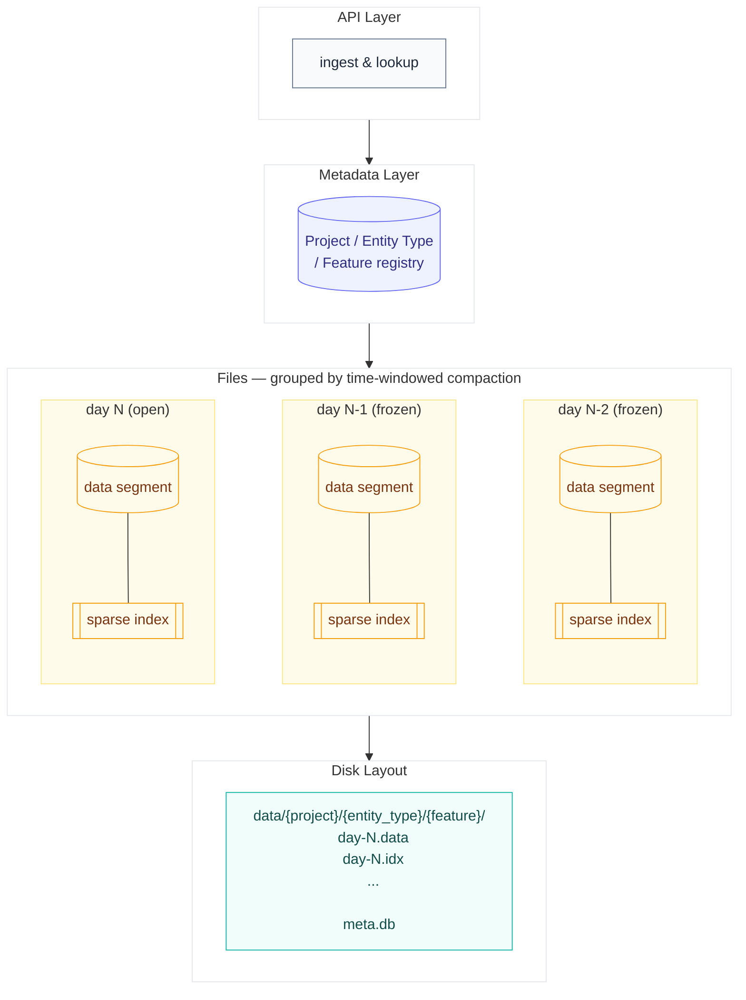

# fslite

The simplest feature store implementation, written in Rust. fs (feature store) + lite.

## Problem & Purpose

Existing feature stores (e.g., Feast) are heavy — separate registry/online/offline
services with a big dependency footprint (Redis, Spark, Postgres, etc.), costly to
run and integrate. fslite: the lightest, fastest feature store, usable as an
embedded library or a standalone server via simple API calls.

- **Top priority**: online point-lookup latency.
- **Secondary priority**: efficient offline (point-in-time) reads from disk, for
  training-set generation.

## Components

- **Project**: unit of access control / namespace, e.g., `fraud-detection`.
- **Entity type**: category features are grouped under, e.g., `user`, `stock`. Each
  instance (an *entity*) has an `entity_id`, e.g., `user#42`.
- **Feature**: a value describing an entity, e.g., `user.age`, `stock.price`.
- **Source**: where data is ingested from (Kafka, CSV, a DB table, ...).
- **Sink**: where data is sent to (training pipeline, online store, dashboard, ...).

## Architecture

**Metadata layer** — Projects, entity types, and features live in
[Turso](https://turso.tech) (built on libSQL, a Rust-native fork of SQLite):
embedded, reliable, no separate service to run. Each feature's row also records
the build parameters used for its on-disk files (sparse index block size, time
window size — see below), so a feature can be rebuilt later with different
parameters without ambiguity about how the existing files were built.

**Ingestion** — A client connection is scoped to one `(project, entity_type,
entity_id)` and streams `(feature, timestamp, value)`. Timestamps may arrive
out of order (backfills supported).

**File layout (per feature)** — Each `(project, entity_type, feature)` has a WAL
and a base file, both using length-prefixed records `[len][entity_id][timestamp]
[value]` (entity_id/value are variable-length, so no fixed-record indexing, no
separate value file, no B+Tree):

- *WAL*: append-only, arrival order, sequential-only access (replay / compaction).
- *Base file*: time-windowed — one segment per time window (default **1 day**,
  configurable per feature). New writes land in the current (open) window; each
  compaction pass only rebuilds the window(s) touched since the last pass, so a
  new write never re-rewrites a feature's entire history — only its own window.
  Closed windows are effectively frozen. Within a window, entities are sorted by
  `(entity_id, timestamp)`; a window is fully rewritten (not mutated in place)
  each time it's recompacted.
- *Sparse index*: one per window segment, built during that segment's
  compaction — every N bytes written (default **4096**, i.e. common OS page /
  disk block size, configurable per feature and recorded in the metadata layer),
  record `(next entity_id, byte offset)`. Byte-based so worst-case scan per
  lookup is bounded despite variable record sizes. A finer block size wastes
  memory without reducing real disk I/O (you can't read less than a block
  anyway); a coarser one wastes lookup time scanning bigger blocks. Small enough
  to load fully into memory.
- *Lookup*: pick the window(s) covering the requested timestamp (or all windows,
  for "latest"/no-timestamp offline queries), binary-search that window's
  in-memory index → seek to block → linear scan (via length prefixes) until
  match, a larger entity_id (miss), or next block.

**Write path** — Write appends to the WAL and synchronously updates an in-memory
index of the **latest** `(timestamp, value)` per `(entity_id, feature)` only (no
history). A per-feature background compactor runs on a fixed interval, doing the
WAL→base-file merge above.

**Read path**

- *Online* (no timestamp): latest value from the in-memory index — O(1), fastest path.
- *Offline* (timestamp `t` + per-feature tolerance `y`): always disk, via the base
  file lookup above, most recent value in `(t - y, t]`. No match → null.
- Multi-entity lookups fan out per-entity and merge results.

**Crash recovery** — Reload base file + replay WAL since last compaction to
rebuild the in-memory index.

## Milestones

**Phase 1 (single node)** — everything above: metadata layer, ingestion, WAL +
time-windowed base files + sparse index, write path, read path, crash recovery.
Also included now (not deferred) even though it's only meaningful for phase 2:
every request already passes through a "resolve target node for this shard"
step — in phase 1 it trivially always resolves to the single local node, so
phase 2 only has to swap the implementation of that one step, not the protocol,
file layout, or metadata schema.

**Phase 2 (horizontal scaling)** — sharding by `(project, entity_type, feature)`
(and by `entity_id` range within a feature, if one feature alone outgrows a
node), routed through a **single authoritative metadata/routing node**: it
owns the shard map and every request resolves its target node through it
first. Simpler consistency than replicating metadata everywhere (one source of
truth, no sync mechanism needed), at the cost of an extra hop and being a
bottleneck/single point of failure unless later mitigated (e.g., client-side
caching of the shard map, or a hot standby). No cloud dependency — Turso's
embedded-replica sync was considered but requires a Turso Cloud primary, which
is out of scope.

## Known limitations (Phase 1)

- **Compaction lag**: point-in-time reads only see the compacted base file, not
  the WAL tail — a timestamp inside the current compaction window may return
  stale/missing data until the next compaction. Accepted trade-off for keeping
  the online path simple (latest-only, no bounded history in memory).
